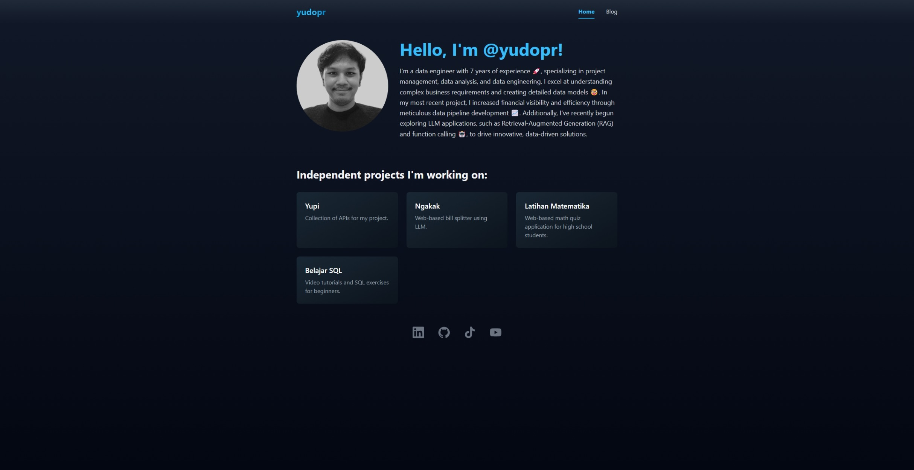
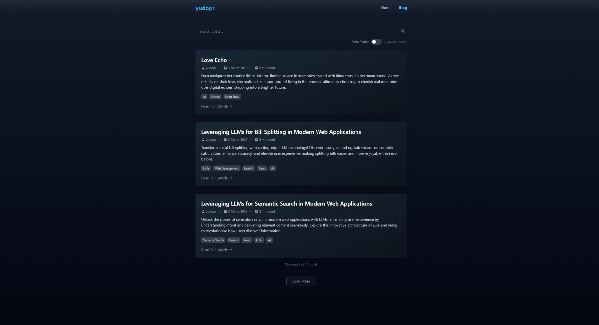

# Yulog

A modern, responsive personal blog and portfolio site built with React, TypeScript and Tailwind CSS.

<!-- Note: Add a screenshot of your site here -->



## Features

- 🔍 **Advanced Search** - Find posts with both keyword and AI-powered semantic search
- 📱 **Fully responsive design** - Looks great on all devices
- 🎨 **Dark theme** - Easy on the eyes
- 📝 **Rich Markdown support** - Write content with formatting, code blocks, and more
- 📑 **Table of Contents** - Auto-generated for blog posts
- 🔗 **SEO optimized** - Dynamic page titles and descriptions
- 💻 **Code syntax highlighting** - With copy-to-clipboard functionality
- ⚡ **Fast loading** - Optimized for performance
- 🔙 **Back to top button** - Easy navigation for long posts
- 🔄 **Load more pagination** - Smooth infinite scroll-like experience

## Tech Stack

- **Frontend**: React, TypeScript
- **Styling**: Tailwind CSS
- **Routing**: React Router
- **Markdown**: React Markdown with remark/rehype plugins
- **Build Tool**: Vite
- **Package Manager**: npm

## Getting Started

### Prerequisites

- Node.js (v18 or newer)
- npm or yarn

### Installation

1. Clone the repository
```bash
git clone https://github.com/yourusername/yulog.git
cd yulog
```

2. Install dependencies
```bash
npm install
```

3. Create a .env file based on .env.example
```bash
cp .env.example .env
```

4. Start the development server
```bash
npm run dev
```

5. Open your browser and visit `http://localhost:300`

## Smart Search with RAG

Yulog includes a powerful search feature using Retrieval Augmented Generation (RAG) technology:

- **Semantic Search**: Intelligently matches content based on meaning, not just keywords
- **Toggle Option**: Users can switch between basic keyword search and AI-powered search
- **Configurable**: Enable/disable RAG by default via environment variables

The search feature works by:
1. Converting search queries into semantic embeddings using AI
2. Finding content that matches the intent of the search, even when exact keywords aren't present
3. Ranking results by semantic relevance to provide the most meaningful matches

This provides a significantly better search experience than traditional keyword-based searching.

## Project Structure

```
yulog/
├── public/             # Static assets
├── src/
│   ├── components/     # React components
│   │   ├── blog/       # Blog-specific components
│   │   ├── common/     # Reusable components
│   │   └── ...
│   ├── services/       # API and other services
│   ├── App.tsx         # Main application component
│   ├── main.tsx        # Entry point
│   └── ...
├── package.json        # Dependencies and scripts
├── tailwind.config.js  # Tailwind CSS configuration
├── tsconfig.json       # TypeScript configuration
└── vite.config.ts      # Vite configuration
```

## Key Components

### Blog Components

- **Blog**: Main blog listing page with search functionality
- **PostDetail**: Blog post detail page with table of contents
- **TableOfContents**: Auto-generated navigation from post headings
- **MarkdownRenderers**: Custom renderers for Markdown content

### Common Components

- **PageTitle**: SEO-friendly dynamic page titles
- **ProjectCard**: Showcases projects with links
- **SocialLink**: Displays social media links
- **LoadingSpinner**: Loading indicator

## Building for Production

To build the app for production, run:

```bash
npm run build
```

The built files will be in the `dist` directory, ready to be deployed.

## Deployment

### Railway

Deploying to Railway is simple:

1. Create an account on [Railway](https://railway.app)
2. Click "New Project" on the Railway dashboard or "New Services" inside Railway Project
3. Select "Deploy from GitHub repo"
4. Choose your cloned repository
5. Railway will automatically detect the Vite configuration and deploy your site

That's it! Railway will automatically build and deploy your application. If needed, you can add environment variables in your project settings.

## Customization

### Styling

The project uses Tailwind CSS for styling. You can customize the theme in `tailwind.config.js`.

### Content

Update the content in the appropriate components:

- Home page content: `src/components/Home.tsx`
- Blog posts: Managed through the API service

## License

This project is licensed under the MIT License - see the LICENSE file for details.

## Acknowledgments
- Created by [yudopr](https://github.com/yudopr11)
- Built with [Vite](https://vitejs.dev/), [React](https://reactjs.org/), [TypeScript](https://www.typescriptlang.org/), and [Tailwind CSS](https://tailwindcss.com/)
- Deploy with [Railway](https://railway.app)