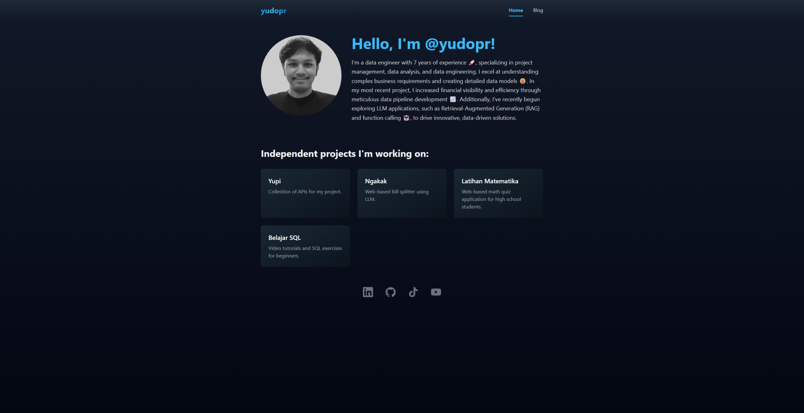
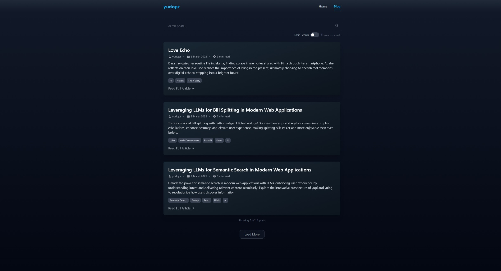

# Yulog

A modern, responsive personal blog and portfolio site built with React, TypeScript and Tailwind CSS — styled with the **Cuan Design System** (deep navy, Cuan Sky accent, glassmorphic cards).

<!-- Note: Add a screenshot of your site here -->



## Features

- **Advanced Search** - Find posts with both keyword and AI-powered semantic search
- **Fully responsive design** - Looks great on all devices
- **Cuan Design System** - Deep navy background, Cuan Sky (#30BDF2) accent, glassmorphic gradient cards
- **Rich Markdown support** - Formatting, code blocks, math (KaTeX), and more
- **Syntax highlighting** - Powered by Shiki with copy-to-clipboard
- **Table of Contents** - Auto-generated for blog posts
- **SEO optimized** - Dynamic page titles and meta descriptions
- **HeroDashboard hero** - Stat cards, profile photo, Stack/Exploring chips
- **Back to top button** - Easy navigation for long posts
- **Load more pagination** - Smooth infinite scroll-like experience
- **Scroll animations** - Powered by AOS

## Tech Stack

- **Frontend**: React 19, TypeScript
- **Styling**: Tailwind CSS v4
- **Routing**: React Router v7
- **Markdown**: React Markdown with remark/rehype plugins
- **Math rendering**: KaTeX
- **Syntax highlighting**: Shiki
- **Animations**: AOS
- **HTTP client**: Axios
- **Build Tool**: Vite 6
- **Package Manager**: npm

## Getting Started

### Prerequisites

- Node.js (v22 or newer)
- npm

### Installation

1. Clone the repository
```bash
git clone https://github.com/yudopr11/yulog.git
cd yulog
```

2. Install dependencies
```bash
npm install
```

3. Create a `.env` file based on `.env.example`
```bash
cp .env.example .env
```

4. Start the development server
```bash
npm run dev
```

5. Open your browser and visit `http://localhost:5173`

## Smart Search with RAG

Yulog includes a powerful search feature using Retrieval Augmented Generation (RAG) technology:

- **Semantic Search**: Intelligently matches content based on meaning, not just keywords
- **Toggle Option**: Users can switch between Keyword and Semantic (AI-powered) search via a period-toggle control
- **Configurable**: Enable/disable RAG by default via environment variables

The search feature works by:
1. Converting search queries into semantic embeddings using AI
2. Finding content that matches the intent of the search, even when exact keywords aren't present
3. Ranking results by semantic relevance to provide the most meaningful matches

## Project Structure

```
yulog/
├── public/             # Static assets
├── src/
│   ├── components/
│   │   ├── blog/       # Blog-specific components
│   │   ├── common/     # Reusable components
│   │   ├── home/       # Home page sections
│   │   ├── App.tsx
│   │   ├── Blog.tsx
│   │   ├── Home.tsx
│   │   ├── Navbar.tsx
│   │   └── ...
│   ├── hooks/          # Custom React hooks
│   ├── services/       # API and other services
│   ├── types/          # TypeScript type definitions
│   ├── index.css       # Cuan Design System CSS custom properties
│   └── main.tsx        # Entry point
├── package.json
├── tailwind.config.js
├── tsconfig.json
└── vite.config.ts
```

## Key Components

### Blog Components

- **Blog**: Main blog listing page with Cuan-styled search and period-toggle (Keyword / Semantic)
- **PostDetail**: Blog post detail page with table of contents
- **PostHeader**: Chip-brand tags, title, author icon-tile, calendar/clock metadata
- **TableOfContents**: Auto-generated navigation from post headings
- **MarkdownRenderers**: Custom renderers for Markdown content (code, math, images)

### Home Components

- **HeroCard**: HeroDashboard — 2-col grid with stat cards, profile photo, Stack/Exploring chips
- **TechStackSection**: Technology stack showcase
- **ExpertiseCard**: Expertise areas display
- **ProfessionalTimeline**: Career timeline
- **NumberCounter**: Animated stat counters
- **DataFlowVisualization**: Visual data flow diagram
- **SocialCTAFooter**: Connect section with radial glow and Cuan-button CTAs

### Common Components

- **ProjectCard**: Cuan card with icon tiles, chip tags, and CTA buttons
- **PageTitle**: SEO-friendly dynamic page titles
- **SocialLink**: Social media links
- **ErrorAlert**: Error display component
- **LoadingSpinner**: Loading indicator

## Cuan Design System

Yulog uses the Cuan DS vocabulary for all UI components:

| Class | Purpose |
|---|---|
| `cuan-card` | Glassmorphic gradient card |
| `cuan-nav` | Frosted-glass navbar |
| `cuan-btn` | Primary call-to-action button |
| `chip` / `chip-brand` | Tag/label pills |
| `icon-tile` | Semantic colored icon boxes |
| `eyebrow` | Small uppercase section labels |
| `brand-text` | Gradient brand wordmark |
| `period-toggle` | Segmented toggle control |

Colors are defined as CSS custom properties in `src/index.css` (e.g. `--bg-base`, `--fg-*`, `--border-*`, `--gradient-*`).

## Building for Production

```bash
npm run build
```

Built files will be in the `dist` directory.

## Deployment

### Railway

1. Create an account on [Railway](https://railway.app)
2. Click "New Project" → "Deploy from GitHub repo"
3. Choose your repository
4. Railway will automatically detect the Vite configuration and deploy your site

Add any required environment variables in your Railway project settings.

## License

This project is licensed under the MIT License - see the LICENSE file for details.

## Acknowledgments

- Created by [yudopr](https://github.com/yudopr11)
- Built with [Vite](https://vitejs.dev/), [React](https://reactjs.org/), [TypeScript](https://www.typescriptlang.org/), and [Tailwind CSS](https://tailwindcss.com/)
- Styled with the [Cuan Design System](https://github.com/yudopr11/cuan)
- Deploy with [Railway](https://railway.app)
